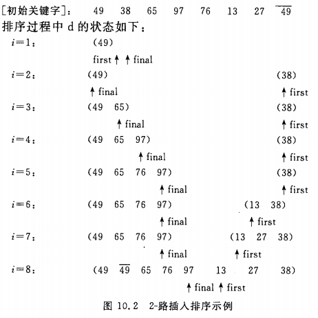
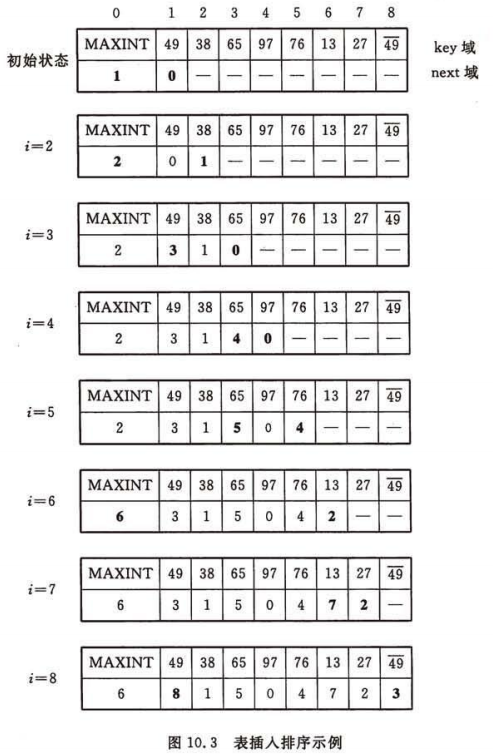
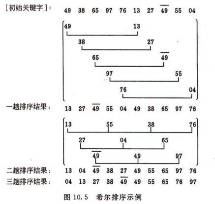

## 第10章 内部排序<a id="10"></a>
>><!--ts-->
>>* <a href="#101">10.1 概述</a><br>
>>* <a href="#102">10.2 插入排序</a><br>
>>   * <a href="#1021">10.2.1 直接插入排序</a><br>
>>   * <a href="#1022">10.2.2 其他插入排序</a><br>
>>   * <a href="#1023">10.2.3 希尔排序</a><br>
>>* <a href="#103">10.3 快速排序</a><br>
>>   * <a href="#1031">10.3.1 冒泡排序</a><br>
>>   * <a href="#1032">10.3.2 快速排序</a><br>
>>* <a href="#104">10.4 选择排序</a><br>
>>    * <a href="#1041">10.4.1 简单选择排序</a><br>
>>    * <a href="#1042">10.4.2 树形选择排序</a><br>
>>    * <a href="#1043">10.4.3 堆排序</a><br>
>>* <a href="#105">10.5 归并排序</a><br>
>>* <a href="#106">10.6 基数排序</a><br>
>>    * <a href="#1061">10.6.1 多关键字的排序</a><br>
>>    * <a href="#1062">10.6.2 链式基数排序</a><br>
>><!--te-->
### <a href="#10">10.1 概述<a> <a id="101"></a>
（1）了查找方便，通常希望计算机中的表是按关键字有序的<br>
（2）排序方法是否稳定<br>
（3）内部排序：内存<br>
（3）外部排序：内存 + 外存<br>
（4）依据的不同原则： 插入排序、交换排序、选择排序，归并排序和计数排序<br>
（5）工作量：简单的排序方法$O(n^2)$，先进的排序$O(nlogn)$，计数排序$O(d * n)$<br>
（6）操作：比较和移动<br>
### <a href="#10">10.2 插入排序<a> <a id="101"></a>
#### <a href="#10">10.2.1 直接插入排序<a> <a id="1021"></a>
<b>基本操作:</b> 将一个记录插入到已排好序的有序表中，从而得到一个新的、记录数增1的有序表

```c++
void insert_sort(sqtable & a)
{//O(n ** 2)
    int len = a.length(), i = 1, j, k;
    data_t tmp;
    /** 跳过有序子序列*/
    while (i < len && a[i] > a[i -1]) ++i;
    for(; i < len; ++i)
    {
        if(a[i] >= a[i - 1]) continue;//已经是正确位置
        for(j = 0; j < i - 1; ++j) //顺序查找a[i]插入0...i-1位置
          if(a[i] < a[j]) break;
        tmp = a[i];
        for(k = i - 1; k >= j; --k) a[k + 1] = a[k];//移动
        a[j] = tmp;//插入
    }
}
```
#### <a href="#10">10.2.2 其他插入排序<a> <a id="1022"></a>
<b>1.折半插入排序</b><br>
这个"查找"操作可利用"折半查找"来实现

```c++
int bin_locate(const sqtable & a const key_t & k, int start, int end)
{
    int l= start, h= end, mid;
    while(l <= h)
    {
        mid = (l + h) / 2;
        if(k < a[mid] ) h = mid - 1;//左半区
        else l = mid + 1;
    }
    return l + 1;
}
void binsert_sort(sqtable & a)
{//O(n ** 2)
    int len = a.length(), i = 1, j, k;
    data_t tmp;
    /** 跳过有序子序列*/
    while (i < len && a[i] > a[i -1]) ++i;
    for(; i < len; ++i)
    {
        if(a[i] >= a[i - 1]) continue;//已经是正确位置
        j = bin_locate(a, a[i], 0, i - 1);//折半查找a[i]插入0...i-1位置
        tmp = a[i];
        for(k = i - 1; k >= j; --k) a[k + 1] = a[k];//移动
        a[j] = tmp;//插入
    }
}
```

<b>2.2-路插入排序</b><br>
（1）其目的是减少排序过程中移动记录的次数，但为此需要n个记录的辅助空间<br>
（2）时间复杂度仍是$O(n^2)$。<br>
（3）当table[0]是待排序记录中关键字最小或最大的记录时，2-路插入排序就完全失去它的优越性
<br>
<b>[算法描述]</b><br>
并将d[0]看成是在排好序的序列中处于中间位置的记录，然后从第2个记录起依次插入到d[0]之前或之后的有序序列中

```c++
void towway_insert(sqtable & tab)
{
    int len = tab.length() + 1, first = 0, last = 1, i, j ,k;
    data_t * d = new data_t[len + 1], tmp;
    d[0] = tab[0];

    for(i = 1; i < tab.length(); ++i)
    {
        tmp = tab[i];
        if(tmp < tab[0])//插入d[0]前面的子序列
        {
            if(first == 0)
            {
                first = len - 1;
                d[fisrt] = tmp;
            }
            else
            {
                /** 寻找插入位置*/
                for(j = len - 1; j >= first; --j)
                    if(tmp > d[j]) break;
                /** first...j序列左移*/
                for(k = fisrt; k <= j; ++k) d[k -1] = d[k];
                d[j] = tmp; --first;
            }
        }
        else//插入d[0]后面的子序列
        {
            /** 寻找插入位置*/
            for(j = 0; j < last; ++j)
                if(tmp < d[j]) break;
            /** j...last序列右移*/
            for(k = last - 1; k >= j; --k) d[k + 1] = d[k];
            d[j] = tmp; ++last;
        }
    }
    /** 复制排序结果到原表*/
    for(i = 0, j = first; j != last; ++i, j = (j + 1) % len)
        tab[i] = d[j];
    delete [] d;
}
```

<b>3.表插入排序</b><br>
（1）若希望在排序过程中不移动记录，只有改变存储结构，进行表插入排序<br>
（2）以修改2n次指针值代替移动记录，排序过程中所需进行的关键字间的比较次数相同<br>
（3）时间复杂度仍是$O(n^2)$<br>
（4）结果只是求得一个有序链表，则只能对它进行顺序查找，不能进行随机查找
（5）为了能实现有序表的折半查找，尚需对记录进行重新排列
<br>
<b>[算法描述]</b><br>
它可以用一个数组来初始化，初始化用头元素和第一个元素组成一个循环链表，然后排序时从第二
个元素开始插入到这个循环链表中，当然只是修改每个元素的next域。使头结点的next域始终指示
最小的那个元素，然后依次向下：每一个元素的next域都指示比它稍大的那个元素。最大的元素的
next域指示头结点。这样形成一个循环链表。

#### <a href="#10">10.2.3 希尔排序<a> <a id="1023"></a>
（1）"缩小增量排序"（Diminishing Increment Sort），它也是一种属插入排序类的方法。<br>
（2）基本思想∶ 先将整个待排记录序列分割成为若干子序列分别进行直接插入排序，待整个序列中的记录"基本有序"时，再对全体记录进行一次直接插人排序。<br>
<br>
（3）特点∶子序列的构成不是简单地"逐段分割"，而是将相隔某个"增量"的记录组成一个子序列。<br>

```c++
int shell_sort(sqtable & tab, int * delta, int ct)
{
    if(delta[ct -1] != 1) return -1;
    for(int i = 0; i < ct; ++i)
        shell_insert(tab, delta[i]);//一趟增量为dlta[k]的插人排序
    return 0;
}

void shell_insert(sqtable & tab, int dk)
{
    for(int i = 0; i < tab.length(); ++i)//对每个子表进行插入排序
        shell_insert(tab, i, dk);
}

void shell_insert(sqtable & tab, int start, int dk)
{//直接插入排序
    data_t tmp; 
    int i, j, k;
    for(i = start + dk; i < tab.length(); i += dk)
    {
        if(tab[i] > tab[i - dk]) continue;//已经是正确位置
        tmp = tab[i];
        for(j = start; j < i; j+=dk)//顺序搜索tab[i]插入位置
            if(tmp < tab[j]) break;
        for(k = i - dk; k >= j; k-=dk)//右移
            tab[k + 1] = tab[k];
        tab[j] = tmp;//插入
    }
}
```

### <a href="#10">10.3 快速排序<a> <a id="103"></a>
一类藉助"交换"进行排序的方法
#### <a href="#10">10.3.1 起泡排序<a> <a id="1031"></a>
<b>[基本思路]</b><br>
（1）趟：若相邻两个元素逆序，则交换<br>
（2）结束的条件应该是"在一趟排序过程中没有进行过交换记录的操作"<br>
（3）总的时间复杂度为$O(n^2)$。<br>

```c++
void bubble_sort(sqtable & a)
{
    int len = a.length();
    bool swapped;
    for(int i = 0; i < len - 1; ++i)
    {//第i轮排序, 最多n-1轮
        swapped = false;
        for(j = 0; j < len - 1 - i; j++)
            if(a[i] > a[i + 1])
            { 
                swap(a[i], a[i + 1]);
                swapped = true;
            }
        if(!swapped) break;//为发生交换
    }
}
```

#### <a href="#10">10.3.2 快速排序<a> <a id="1032"></a>
<b>[基本思想]</b><br>
它的基本思想是，通过一趟排序将待排记录分割成独立的两部分，其中一部分记录的关键字均比另一部分记录的关键字小，则可分别对这两部分记录继续进行排序，以达到整个序列有序<br>
<b>[具体做法]</b><br>
附设两个指针 low 和 high，它们的初值分别为 low 和 high，设枢轴记录的关键字为 pivotkey，则首先从 high 所指位置起向前搜索找到第一个关健字小于 pivotkey 的记录和枢轴记录互相交换，然后从 low 所指位置起向后搜索，找到第一个关键字大于 pivotkey 的记录和枢轴记录互相交换，重复这两步直至 low=high为止。

```c++
void quick_sort(sqtable & a, int low, int high)
{
    int privot;
    if(low < high)
    {
        privot = quick_partition(a, low, high);
        quick_sort(a, low, privot - 1);
        quick_sort(a, privot + 1, high);
    }
}

int quick_partition(sqtable & a, int low, int hign)
{
    int privot = a[low];
    while(low < high)
    {
        while(low < high && a[high] >= privot) --high;
        a[low] = a[high];// 将比枢轴记量小的记最移到低端
        while(low < high && a[low] <= privot) --low;
        a[high] = a[low];// 将比枢轴记录大的记录移到高
    }
    a[low] = private;
    return low;
}
```
<b>[性能]</b><br>
（1）所有同数量级$(O(nlogn))的排序方法中，其平均性能最好<br>
（2）最坏情况：若初始记录序列按关键字有序或基本有序时，快速排序将蜕化为起泡排序，其时间复杂度为 $O(n^2)$

### <a href="#10">10.4 选择排序<a> <a id="104"></a>
选择排序（Selection Sort）的基本思想是∶每一趟在 n-i+1（i=1，2，…，n-1）个记录
中选取关键字最小的记录作为有序序列中第i个记录。
#### <a href="#10">10.4.1 简单选择排序<a> <a id="1041"></a>
一趟简单选择排序的操作为∶通过 n-i次关键字间的比较，从 n-i＋1个记录中选
出关键字最小的记录，并和第 i（1≤is≤n）个记录交换之
```c++
void select_sort(sqtable & a)
{
    int min;
    for(int i = 0; i < a.length() -1; ++i)
    {
        min = i;
        for(int j = i; j < a.length(); ++j)
            if(a[j] < a[min]) min = j;
        if(min != i) swap(a[min], a[i]);
    }
}
```
（1）时间复杂度为 $O(n^2)$<br>
（2）改进：利用前i-1次比较所得信息，则可减少以后各趟选择排序中所用的比较次数
