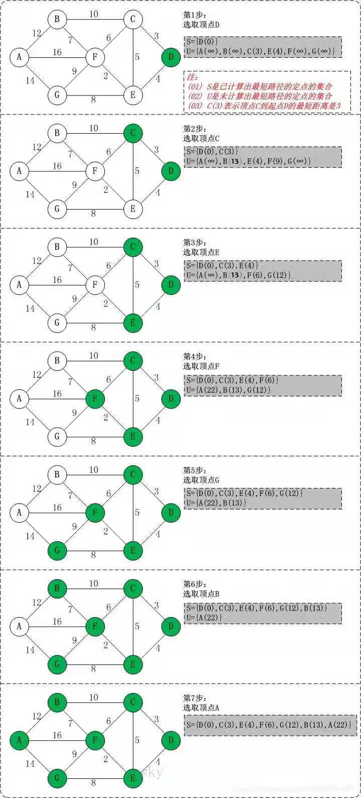

## 第七章 图<a id="7"></a>
>><!--ts-->
>>
>>* <a href="#72">7.2 图的存储结构</a><br>
>>* <a href="#73">7.3 图的遍历</a><br>
>>   * <a href="#731">7.3.1 DFS</a><br>
>>   * <a href="#732">7.3.2 BFS</a><br>
>>* <a href="#74">7.4 图的连通性问题</a><br>
>>   * <a href="#741">7.4.1 无向图的连通分量</a><br>
>>   * <a href="#742">7.4.2 有向图的强连通分量</a><br>
>>   * <a href="#743">7.4.3 最小生成树</a><br>
>>   * <a href="#744">7.4.4 连通图关节点</a><br>
>>* <a href="#75">7.5 有向无环图及其应用</a><br>
>>    * <a href="#751">7.5.1 拓扑排序</a><br>
>>    * <a href="#752">7.5.2 关键路径</a><br>
>>* <a href="#76">7.6 最短路径</a><br>
>>    * <a href="#761">7.6.1 从某个源点到其余各顶点的最短路径</a><br>
>>    * <a href="#762">7.6.2 每一对顶点之词的最短路径</a><br>
>><!--te-->
### <a href="#7">7.2 图的存储结构<a> <a id="72"></a>
```c++
/** 
 * 邻接表：有向图，无向图
 * 利于遍历每个节点的所有邻接点
 * 不利于判断两个节点是否右弧或边
 * 不利于求有向图的度
 * 不利于边的插入，删除，标记
 * */
struct arcnode
{//表节点
    int adjvex;
    struct arcnode * nextarc;
};
struct vexnode
{//头节点
    vex_t data;
    struct arcnode * firstarc;
};
/** O(e + n) 或 O(e * n)*/
void construct(adjlist_graph & G);

/** 
 * 十字链表：有向图
 * 中既容易找到以vi为尾的弧，也容易找到以vi为头的弧，
 * 因而容易求得顶点的出度和人度
 * */
struct arcbox
{//表节点
    int tvex, hvex;
    struct arxbox * tlink, * hlink;
};
struct vexnode
{//头节点
    vex_t data;
    struct arcbox * fisrtout, * firstout;
};

/** 
 * 多重邻接表：无向图
 * 对边进行某种操作，如对已被搜索过的边作记号
 * 或删除一条边等，此时需要找到表示同一条边的两个结点
 * */
struct arcbox
{
    int ivex, jvex;
    struct arcbox * ilink, * jlink;
    bool mark;
};
struct vexbox
{
    vex_t data;
    struct arclink * firstlink;
};
```
### <a href="#7">7.3 图的遍历<a> <a id="73"></a>
>>#### 7.3.1 DFS <a id="731"></a>
>>>>##### 递归实现
>>>>```c++
>>>>/**
>>>> * 邻接矩阵：O(n ** 2)
>>>> * 邻接表：O(n + e)
>>>> * */
>>>>void DFS_traverse(const Graph &G)
>>>>{
>>>>    for (int v = 0; v < G.vexnum(); ++v)
>>>>        if (!visited[v])
>>>>            dfs(G, v, visited);
>>>>}
>>>>void DFS(const Graph &G, int v, bool *visited)
>>>>{
>>>>    visited[v] = true;
>>>>    visit(v);
>>>>    for (auto p = G.first(v); p; p = p.next(v))
>>>>        if (!visited[p->adj(v)])
>>>>            dfs(G, p->adj(v), visited);
>>>>}
>>>>```
>>>>##### 非递归实现
>>>>```c++
>>>>void DFS(const graph & G)
>>>>{
>>>>    int nb = G.vexnum(), v, w, u;
>>>>    array<bool> visited(nb, false);
>>>>    stack<int> s(nb);
>>>>    for(u = 0; u < nb; ++u)
>>>>    {
>>>>        s.push(u);
>>>>        while(!s.empty())
>>>>        {
>>>>            s.pop(v);
>>>>            if(!visited[v])
>>>>            {
>>>>                visited[v] = true;cout << v;
>>>>                for(auto p = G.firstarc(v); p; p = p->nextarc)
>>>>                {
>>>>                    w = p->adj();
>>>>                    if(!visited[w]){s.push(w); break;}
>>>>                }
>>>>            }
>>>>        }
>>>>    }
>>>>}
>>>>```
>>#### 7.3.1 BFS <a id="732"></a>
>>```c++
>>/** 广度优先搜索*/
>>void bfs(Graph &G)
>>{
>>    bool visited[MAX_NUM] = {false};
>>    int v, w, u;
>>    queue q(G.vecnum());
>>    for (v = 0; v < G.vexnum; ++v)
>>        if (!visited[v])
>>        {
>>            visited[v] = true;
>>            visit(v);
>>            q.enqueue(v);
>>            while(!q.is_empty())
>>            {
>>                q.dequeue(w);
>>                for(auto p = G.first(w); p; p = p->next(w))
>>                {
>>                    u = p->adj(w);
>>                    if(!visited[u])
>>                    {
>>                        visit(u);
>>                        visited[u] = true;
>>                        q.enqueue(u);
>>                    }
>>                }
>>            }
>>        }
>>}
>>```
### <a href="#7">7.4 图的连通性问题</a> <a id="74"></a>
>>#### 7.4.1 无向图的连通分量<a id="741"></a>
>>```c++
>>/** 无向图的连通分量和生成树*/
>>void DFS_forest(const Graph &G, cstree &T)
>>{
>>    bool visited[MAX_NUM] = {false};
>>    cstree p = nullptr, q = nullptr;
>>    T = nullptr;
>>    for (int v = 0; v < G.vexnum(); ++v)
>>        if (!visited[v])
>>        {
>>            p = new cstree();
>>            p->data = G.data(v);
>>            if (!T) T = p; //第一棵生成树
>>            else q->nextsibling = p;//是上一邻接顶点的右兄弟结点
>>            q = p; //指示当前生成树的根
>>            DFS_tree(G, v, p, visited);
>>        }
>>}
>>void DFS_tree(const Graph &G, int v, cstree &t, bool *visited)
>>{/** 第v个顶点出发深度优先遍历图G，建立以T为根的生成树*/
>>    bool fisrt = true;
>>    int w, u;
>>    visited[v] = true;
>>    cstree p = nullptr, q = nullptr;
>>
>>    for (auto arc = G.first(v); arc; arc = arc->next(v))
>>    {
>>        w = arc->adj(v);
>>        if (!visited[w])
>>        {
>>            p = new cstree();
>>            p->data = G.data(w);
>>            if (first)
>>            {
>>                first = false;
>>                t->firstchild = p;//根的左孩子结点
>>            }
>>            else q->nextsibling = p;//是上一邻接顶点的右兄弟结点
>>            q = p;//q指向上一生成树
>>            DFS_tree(G, w, p, visited);
>>        }
>>    }
>>}
>>```
>>#### 7.4.2 有向图的强连通分量<a id="742"></a>
>>```c++
>>/** 有向图的强连通分量 : kosaraju*/
>>/** 从顶点v进行DFS*/
>>void DFS(const graph &G, int v, bool *visited, stack &finished, bool r)
>>{
>>    int w;
>>    visited[v] = true;
>>    finished.push(v);
>>    if (r)
>>    {//逆向深度优先搜索
>>        for (auto p = G.rfirst(v); p; p = p->rnext(v))
>>        {
>>            w = p->radj(v);
>>            if (!visited[w]) DFS(G, w, visited, finished, true);
>>        }
>>    }
>>    else
>>    {//正向深度优先搜索
>>        for (auto p = G.first(v); p; p = p->next(v))
>>        {
>>            w = p->adj(v);
>>            if (!visited[w]) DFS(G, w, visited, finished, false);
>>        }
>>    }
>>}
>>/** DFS*/
>>void DFS(const graph &G, stack &finished, bool r = false)
>>{
>>    bool visited[MAX_NODE_NB] = {false};
>>    for (int v = 0; v < G.vexnum(); ++v)
>>        if (!visited[v])
>>            DFS(G, v, visited, finished, r);
>>}
>>void kosaraju(const graph &G)
>>{
>>    bool visited[MAX_NODE_NB] = false;
>>    stack finished(G.vexnum());
>>    stack finished1(G.vexnum());
>>    DSF(G, finished);
>>    int v;
>>    while (finished.pop(v))
>>    {
>>        if (!visited[v]) 
>>        {
>>            finished1.clear();
>>            DFS(G, v, visited, finished1, true);
>>            finished1.show();
>>        }
>>    }
>>}
>>```
>>#### 7.4.3 最小生成树 <a id="743"></a>
>>```c++
>>/**  
>> * 最小生成树
>> * O(n * n)边数无关，因此适用于求边稠密的网的最小生成树
>> */
>>int prime(const graph & G, int u)
>>{
>>    int nb = G.vexnum(), ct = 0, min_vex;
>>    G::cost_t min_cost, cost = 0;
>>    closege * closeges  = new closege[nb];
>>    /** 进入初态*/
>>    closeges[u].lowcost = 0;
>>    ++ct;
>>    for(int v = 0; v < nb; ++v)
>>        if(v != u) closeges[v] = {u, G.cost(u,v)};
>>
>>    for(int v = 0; v < nb && ct < nb; ++v)
>>    {
>>        min_cost = INI_MAX;
>>        for(int w = 0 ; w < nb; ++w)//搜寻V-U和U之间最小
>>            if(closeges[w].lowcost != 0 && min_cost > closeges[w].lowcost)
>>            {
>>                min_cost = closeges[w].lowcost;
>>                min_vex = w;
>>            }
>>        cost += min_cost;
>>        closeges[min_vex].lowcost = 0;//并入U
>>        ++ct;
>>        for(int w = 0; w < nb; ++w)//更新closedges
>>            if(G.cost(min_vex, w) < closeges[w].lowcost)
>>                closeges[w] = {min_vex, G.cost(min_vex, w)};
>>    }
>>    print(closeges);
>>    delete [] closeges;
>>    return cost;
>>}
>>```
>>#### 7.4.4 关节点 <a id="744"></a>
>>```c++
>> /** 时间复杂度仍O(n+e)：进行了一次DFS*/
>>int DFS_artical(const graph & G, 
>>                int v, 
>>                int * visited, 
>>                int * low, 
>>                int & ct)
>>{
>>    int mim = ++ct, w;
>>    visited[v] = min;
>>    bool fisrt = true;
>>    for(auto p = G.fisrt(v); p; p = p->next(v))
>>    {/** 从v的邻接点开始，做DFS*/
>>        w = p->adj(v);
>>        if(!visited[w])
>>        {
>>            DFS_artical(G, w, visited, low, ct);
>>            if(low[w] < min) min = low[w];
>>            if(low[w] > visited[v] && first)
>>            {//没有到v祖先的回边
>>                cout << v;
>>                first = false;
>>            }
>>        }
>>        else if(low[w] < min) min = low[w];
>>    }
>>    low[v] = min;
>>}
>>int find_artical(const graph & G)
>>{
>>    int visited[grapha::MAX_NODE_NB] = {0}, //v顶点DFS遍历时的位置
>>        low[grapha::MAX_NODE_NB] = {0},//顶点v能回溯到的最浅层的位置
>>        ct = 0;
>>    for(int v = 0; v < G.vexnum(); ++v)
>>      if(!visited)
>>      {
>>          DFS_artical(G, v, visited, low, ct);
>>          if(ct < G.vexnum()) cout << v;
>>      }
>>}
>>```
### <a href="#7">7.5 有向无环图及其应用</a> <a id="75"></a>
>>#### 7.5.1 拓扑排序 <a id="751"></a>
>><b>算法描述</b>：<br>
>>（1）在有向图中选一个没有前驱的顶点且输出之。</br>
>>（2）从图中删除该顶点和所有以它为尾的弧。</br>
>>重复上述两步，直至全部顶点均已输出，或者当前图中不存在无前驱的顶点为止。后</br>
>>一种情况则说明有向图中存在环。</br>
>>针对上述两步操作，我们可采用邻接表作有向图的存储结构，<br>
>>且在头结点中增加一个存放顶点入度的数组（indegree）。<b>入度为零的顶点即为没有前驱</b><br>
>>的顶点，删除顶点及以它为尾的弧的操作，则可换以<b>弧头顶点的入度减1来实现</b><br>
>>为了避免重复检测入度为零的顶点，可另设一<b>栈</b>暂存所有入度为零的顶点<br>
>>```c++
>>bool topo_sort(const graph & G)
>>{
>>    int indegree[graph::MAX_NODE_NB], ct = 0, v, w;
>>    stack s(G.vexnum());
>>    G.get_indegrees(indegree, G.vexnum());
>>    for(v = 0; v < G.vexnum(); ++v)
>>        if(indegree[v] == 0) s.push(v);
>>    while(!s.empty())
>>    {
>>        s.pop(v);
>>        cout << v;
>>        ct++;
>>        for(auto p = G.first(v); p; p=p->next(v))
>>        {/** 模拟删除顶点v及以v为弧尾的弧*/
>>            w = p->adj(v);
>>            if((--indegree[w]) == 0)s.push(w);
>>        }
>>    }
>>    return (ct == G.vexnum());
>>}
>>```
>>### 7.5.2 关键路径 <a id="752"></a>
>>$e(i)= ve(i)$ --活动最早开始时间<br>
>>$l(i) = vl(k) - dut<j, k>$ --活动最晚开始时间<br>
>>$ve[j] = max\{v[j] + dut<i,j>\}, <i, j> \in edges$ <br>
>>$vl[j] = min\{v[k] - dut<j,k>\}, <j, k> \in edges$ <br>
>>```c++
>>bool topo_sort(const graph & G, stack & T, array & ve)
>>{/** 排序并计算每个活动的最早开始时间ve[j]*/
>>    int indegree[graph::MAX_NODE_NB], ct = 0, v, w;
>>    stack s(G.vexnum());
>>    G.get_indegrees(indegree, G.vexnum());
>>    for(v = 0; v < G.vexnum(); ++v)
>>        if(indegree[v] == 0) s.push(v);
>>    while(!s.empty())
>>    {
>>        T.push(v);
>>        for(auto p = G.first(v); p; p=p->next(v))
>>        {/** 模拟删除顶点v及以v为弧尾的弧*/
>>            w = p->adj(v);
>>            if((--indegree[w]) == 0)s.push(w);
>>            if(ve[v] + p->cost(v) > ve[w]) 
>>                ve[w] = ve[v] + p->cost(v) > ve[w]
>>        }
>>    }
>>}
>>bool critical_path(const graph & G)
>>{
>>    stack T(G.vexnum());
>>    graph::cost_t ee, el, ve[MAX_NODE_NB] = {0}, vl[MAX_NODE_NB], dut;
>>    int v, w;
>>    if(!topo_sort(G, T, ve)) return false;
>>    for(v = 0; v < G.vexnum(); ++v) vl[v] = vl[G.vexnum() -1];
>>    while(!T.is_empty())
>>    {//逆拓扑序列求vl[j]
>>        T.pop(v);
>>        for(auto p = G.fisrt(v); p; p = p->next(v))
>>        {
>>            w = p->adj(v);dut = p->cost(v);
>>            if(vl[v] > vl[w] - dut) vl[v] = vl[w] - dut;
>>        }
>>    }
>>    for(v = 0; v < G.vexnum(); ++v) 
>>    {//输出关键活动
>>        for(auto p = G.fisrt(v); p; p = p->next(v))
>>        {
>>            w = p->adj(v);
>>            dut = p->cost(v);
>>            ee = v[v];
>>            el = v[w] - dut;
>>            cout << {v, w, ee, el, (ee==el)};
>>        }
>>    }
>>}
>>```
>>### 7.6 最短路径 <a id="76"></a>
>>#### 7.6.1 从某个源点到其余各顶点的最短路径 <a id="761"></a>
>><br>
>>```c++
>>void dijkstra(const graph & G, 
>>              int start, //源点
>>              matrix & paths, //start到vi的路径
>>              array & D)//start到vi的路径长度
>>{
>>    graph::cost_t min;
>>    array<bool> _final(G.vexnum(), false);//belong to S
>>    int v, w, nb = G.vexnum(), min_vex;
>>    /** enter start state*/
>>    for(v = 0; v< nb; ++v)
>>        D[v] = G.cost(start, v);
>>    D[start] = 0; _final[start] = true;
>>    for(v = 0; v < nb; ++v)
>>    {
>>        /** find vertex in V-S which closest to start*/
>>        min = INF;//infinite
>>        for(w = 0; w < nb; ++w)
>>            if(!_final[w] && D[w] < min)
>>            {
>>                min = D[w];
>>                min_vex  = w;
>>            }
>>        /** add into S*/
>>        _final[min_vex] = true;
>>        /** update current min paths and distances*/
>>        for(w = 0; w < nb; ++w)
>>            if(D[w] > G.cost(min_vex, w) + min)
>>            {
>>                D[w] = G.cost(min_vex, w) + min;
>>                for(int x = 0; x < nb; ++x)
>>                    paths[x][w] = paths[min_vex][w];
>>                paths[w][w] = true;
>>            }
>>    }
>>}
>>```
>>#### 7.6.2 每一对顶点之词的最短路径 <a id="762"></a>
>>```c++
>>void floyd(const graph & G, array3 & paths, matrix & D)
>>{
>>    int nb = G.vexnum();
>>    /** enter start state*/
>>    for(int v = 0; v < nb; ++v)
>>        for(int w = 0; w < nb; ++w)
>>        {
>>            for(int i = 0; i <nb; ++i)
>>                paths[v][w][i] = false;
>>            D[v][w] = G.cost(v, w);
>>            if(D[v][w] < INF)
>>            {//{v, w} has direct connectiong 
>>                path[v]v[w][w] = true;
>>                path[v][w][v] = true;
>>            }
>>        }
>>    for(int u = 0; u < nb; ++u)
>>        for(int v = 0; v < nb; ++v)
>>            for(int w = 0; w < nb; ++w)
>>            {
>>                if(D[v][u] < INF && D [u][w] < INF 
>>                    && D[v][u] + D[u][w] < D[v][w])
>>                {//shorter one after adding a middle vertex
>>                    D[v][w] = D[v][u] + D[u][w];
>>                    /** add vertexs in su-path(v...u or u...w) into path[v][w] */
>>                    for(int i = 0; i < nb; ++i)
>>                        paths[v][w][i] = (paths[v][u][i] || paths[u][w][i]);
>>                    paths[v][w][v] = paths[v][w][w] = true;
>>                }
>>            }
>>}
>>```c
