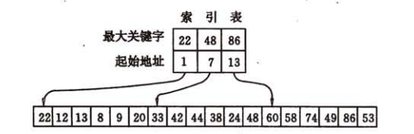

## 第九章 查找<a id="9"></a>
>><!--ts-->
>>* <a href="#91">9.1 静态查找表</a><br>
>>   * <a href="#911">9.1.1 顺序表的查找</a><br>
>>   * <a href="#912">9.1.2 有序表的查找</a><br>
>>      * <a href="#9121">折半查找</a><br>
>>      * <a href="#9122">其他：斐波那契查找、插值查找</a><br>
>>   * <a href="#913">9.1.3 静态树的查找</a><br>
>>      * <a href="#9131">次优查找树</a><br>
>>   * <a href="#914">9.1.4 索引顺序表的查找</a><br>
>>* <a href="#92">9.2 动态查找表</a><br>
>>   * <a href="#921">9.2.1 二叉排序树和平衡二叉树</a><br>
>>      * <a href="#9211">1. 二叉排序树及其查找过程</a><br>
>>      * <a href="#9212">2. 二叉排序树的插入和删除</a><br>
>>      * <a href="#9213">3. 二叉排序树的查找分析</a><br>
>>   * <a href="#922">9.2.2 B-树和B+树</a><br>
>>   * <a href="#923">9.2.3 键树</a><br>
>>* <a href="#93">9.3 哈希表</a><br>
>>    * <a href="#932">9.3.2 哈希函数的构造方法</a><br>
>>    * <a href="#933">9.3.3 处理冲突的方法</a><br>
>>    * <a href="#934">9.3.4 哈希表的查找及其分析</a><br>
>><!--te-->
### <a href="#9">9.1 静态查找表<a> <a id="91"></a>
#### <a href="#9">9.1.1 顺序表的查找<a> <a id="911"></a>
查找操作的性能衡量-均查找长度ASL：<br>
<!--\overset{顶部内容}{正常内容}, \underset{底部内容}{正常内容}-->
ASL = $\underset{i = 1}{\overset{n}{\sum}}P_iC_i$ $\qquad$
$\underset{i = 1}{\overset{n}{\sum}}P_i = 1$ <br>
$P_i$为查找表中第i个记录的概率<br>
$C_i$为找到表中其关键字与给定值相等的第i个记录时，和给定值已进行过比较的关键字个数。<br>
<b>等概率</b>情况下顺序查找的平均查找长度为：<br>
${ASL}_{ss} = \frac{1}{n}\underset{i = 1}{\overset{n}{\sum}}(n - i + 1) 
= \frac{n + 1}{2}$<br>
假设查找成功与不成功的可能性相同，对每个记录的查找<b>概率也相等</b>，则$P=\frac{1}{2n}$，此时顺序查找的平均查找长度为:<br>
$${ASL}_{ss} = \frac{1}{2n}\underset{i = 1}{\overset{n}{\sum}}(n - i + 1) + \frac{n+ 1}{2} = \frac{3}{4}(n + 1)$$

#### <a href="#9">9.2.1 有序表的查找<a> <a id="912"></a>
#### 折半查找--顺序存储结构的有序表 <a id="9121"></a>
性能:<br>
(1)折半查找在查找不成功时和给定值进行比较的关键字个数最多也不超过:     $\lfloor {log}_2n \rfloor + 1$<br>
(2)$ASL = \frac{n+1}{n}{log}_2(n+1) -1 \approx{log}_2(n+1) -1, \quad n > 50$
```c++
int bin_search(const sqtable & tab, const key_t & k)
{
    int low = 0, high = tab.length() - 1 , mid = (low + high) / 2;
    while(low <= high)
    {
        if(tab[mid] == k) return mid;//found
        if(tab[mid] < k) high = mid -1;
        else low  = mid + 1;
    }
    return -1;//not found
}
```
#### 其他：斐波那契查找、插值查找<a id="9122"></a>
#### <a href="#9">9.1.3 静态树的查找<a> <a id="913"></a>
<b>性能</b>：如果只考虑查找成功的情况，则使查找性能达最佳的判定树是其带权内路径长度之和PH值<br>$PH = \underset{i = 1}{\overset{n}{\sum}}w_ih_i$<br>
$h_i$为第i个结点在二叉树上的层次数,结点的权，$w_i=cp_i$（i=1，2，…，n），其中$p_i$为结点的查找概率，c 为某个常量。称 PH 值取最小的二叉树为<b>静态最优查找树</b>

#### <b>次优查找树</b><a id="9131"></a>
l -- low<br>
h -- high<br>
取最小值$\Delta P_i = \underset{l \leq j \leq h}{min}\Delta P_j$
$$\Delta P_i = \lvert\underset{j = i + 1}{\overset{h}{\sum}}w_j - \underset{j = l}{\overset{ i -1}{\sum}}w_j\rvert$$
累计权值和:<br>
$$sw_i = \underset{j = l}{\overset{i}{\sum}}w_j$$
并设$w_{l - 1}=0$和$sw_{l -1}=0$，则
$$\underset{j = l}{\overset{i -1}{\sum}}w_j = sw_{i -1} - sw_{l -1}$$
$$\underset{j = i + 1}{\overset{h}{\sum}}w_j = sw_{h} - sw{i}$$
$$\Delta P_i = \lvert (sw_{h} - sw_{i}) - (sw_{i -1} - sw_{l -1})\rvert = 
\lvert (sw_{h} + sw_{l - 1}) - (sw_{i} + sw_{i -1})\rvert$$
<a><b>构造次优查找树</b></a>

```c++
void second_optimal(bitree & t, array<char> & tab, array<float> w)
{//时间复杂度：O(nlogn)
    array<float> sw(tab.size());
    if(tab.size() != w.size()) return;
    sw[0] = w[0];//计算累计权值
    for(int i = 0; i < sw.size(); ++i)
        sw[i] = w[i] + sw[i - 1];
    second_optimal(t, tab, sw, 0, tab.size() -1);
}
void second_optimal(bitree & t, array<char> & tab, array<float> sw, int low, int high)
{
    float min = adb(sw[high] - sw[low]), dw;
    int min_i = low;
    if(low == 0) dw = sw[high] + 0;
    else dw = sw[low - 1] + sw[high];
    for(int i = low + 1; i <= high; ++i)//寻找最小Pi
        if(dw - sw[i] -sw[i - 1])
        {
            min = dw - sw[i] -sw[i - 1];
            min_i = i;
        }
    t = new bitree(tab[min_i], nullptr, nullptr);
    /** create left sub tree*/
    if(min_i != low) second_optimal(t, tab, sw, low, min_i - 1)
    /** create right sub tree*/
    if(min_i != high) second_optimal(t, tab, sw, i + 1, high)
}
```
<a><b>次优查找树性能: </b></a>次优查找树的平均查找长度和logn成正比

#### <a href="#9">9.1.4 索引顺序表的查找<a> <a id="914"></a>
<a><b>分块查找</b></a>
<br>
分块查找过程需分两步进行。先确定待查记录所在的块（子表），然后在块中顺序查找<br>
分块查找的平均查找长度为: $ASL_{bs} = L_b + L_w$<br>
$L_b$为查找索引表确定所在块的平均查找长度，L_w为在块中查找元素的平均查找
长度<br>
（1）若用顺序查找确定所在块，则分块查找的平均查找长度为<br>
$ASL_{bs} = L_b + L_w = \frac{1}{b}\underset{j=1}{\overset{b}{\sum}}j + \frac{1}{s}\underset{i=1}{\overset{s}{\sum}}i = \frac{b+1}{2} + \frac{s+1}{2} = \frac{1}{2}(\frac{n}{s} + s) + 1$<br>
s为每块含有的记录数目, $s = \sqrt{n}$时，ASL最小，为$\sqrt{n} + 1$<br>
（2）折半查找确定所在块，则分块查找的平均查找长度为<br>
$ASL_{bs} \approx log_2(\frac{n}{s} + 1) + \frac{s}{2}$<br>

### <a href="#9">9.2 动态查找表<a> <a id="92"></a>
#### <a href="#9">9.2.1 叉排序树和平衡二叉树<a> <a id="921"></a>
<a id="9211"><b>1. 二叉排序树及其查找过程</b></a><br>
<b>二叉排序树</b>（Binary Sort Tree）或者是一棵空树;或者是具有下列性质的二叉树:<br>
（1）若它的左子树不空，则左子树上所有结点的值均小于它的根结点的值;<br>
（2）若它的右子树不空，则右子树上所有结点的值均大于它的根结点的值;<br>
（3）它的左、右子树也分别为二叉排序树。<br>
<b>查找过程</b>

```c++
bstree  bstree_search(bstree t, const key_t & k)
{//二叉排序树的查找算法
    if(t == nullptr) return nullptr;//not found
    if(k == t->data) return t;//found
    else if(k < t->data) {return bstree_search(t->lchild, k);}
    else {return bstree_search(t->rchild, k);}
}
```
<a id="9212"> <b>2. 二叉排序树的插入和删除</b></a><br>
插入

```c++
bool bstree_search(bstree t, const key_t & k, bstree f, bstree & p)
{//二叉排序树的查找算法
    if(t == nullptr) 
    {//not found
        p = f;//查找不成功的最后一个节点
        return false;
    }
    if(k == t->data) 
    {//found
        p = t; 
        return true;
    }
    else if(k < t->data) 
        return bstree_search(t->lchild, k, t, p);
    else 
        return bstree_search(t->rchild, k, t, p);
}
bool bstree_insert(bstree & t, const key_t & k)
{//插入
    bstree p, s;
    if(!bstree_search(t, k, nullptr, p))
    {
        s = new bstree(k, nullptr, nullptr);
        if(!p) t = s;//根节点
        else if(k < p->data) p->lchild = s;
        else p->rchild = s;
        return true;
    }
    else return false;
}
```
删除<br>
(1)若\*p结点为叶子结点，即$P_L$和$P_R$均为空树。由于删去叶子结点不破坏整棵
树的结构，则只需修改其双亲结点的指针即可。<br>
(2)若\*p结点只有左子树$P_L$或者只有右子树$P_R$，此时只要令$P_L$或$P_R$。直接成为其双亲结点\*f的左子树即可。<br>
(3)若\*p结点的左子树和右子树均不空。为保特其他元素之间的相对位置不变，可以有两种做法:<br>
>>其一是令\*p的左子树为*f的左子树，而\*p的右子树为\*s的右子树<br>
>>其二是令\*p的直接前驱（或直接后继）替代\*p，然后再从二叉排序树中删去它的直接前驱（或直接后继）<br>
>><b><span style="color:red">PS:中序遍历某个节点直接前驱为其左子树往下最右边的节点；当以直接前驱\*s替代\*p时，由于\*s只有左子树$S_L$，则在
删去\*s之后，只要令$S_L$为\*s的双亲\*q的右子树即可</span></b><br>
<br>

```c++
bool bstree_delete(bstres & t, const key_t & k)
{
    if(!t) return false;
    if(t->data == k) {bstree_delete(t); return true;}
    else if(k < t->data) return bstree_delete(t->lchild, k);
    else return bstree_delete(t->rchild, k); 
}
void bstree_delete(bstree & p)
{//按照情形二删除节点
    bstree s, q;//前驱，前驱的父节点
    if(!q->lchild)//没有左孩子
    {
        q = p;
        p = p->rchild;
        delete q;
    }
    else if(!q->rchild)
    {
        q = p;
        p = p->lchild;
        delete q;
    }
    else
    {//左右孩子都不为空
        /**寻找p的前驱：左子树最右下的节点*/
        q = p;
        s = p->lchild;
        while(s->rchild)
        {
            q = s;
            s = s->rchild;
        }
        p->data = s->data;
        if(q == p) q->lchild = s->lchild;
        else q->rchild = s->lchild;
        delete s;
    }
}
```
<a id="9213"> <b>3.二叉排序树的查找分析</b></a><br>
(1) 折半查找长度为 n 的表的判定树是惟一的，而含有 n个结点的二叉排序树却<b>不惟一</b>。<br>
(2) 当先后插入的关键字有序时，构成的二叉排序树蜕变为单支树。<br>
(3) 在随机的情况下，二叉排序树的平均查找长度和<b>logn是等数量级的</b> <br>
<br>