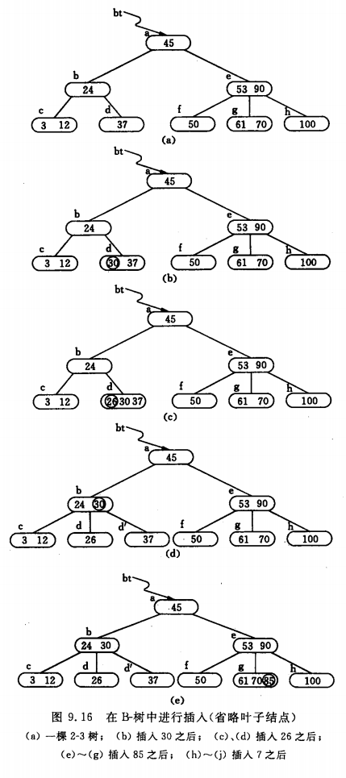

## 第九章 查找<a id="9"></a>
>><!--ts-->
>>* <a href="#91">9.1 静态查找表</a><br>
>>   * <a href="#911">9.1.1 顺序表的查找</a><br>
>>   * <a href="#912">9.1.2 有序表的查找</a><br>
>>      * <a href="#9121">折半查找</a><br>
>>      * <a href="#9122">其他：斐波那契查找、插值查找</a><br>
>>   * <a href="#913">9.1.3 静态树的查找</a><br>
>>      * <a href="#9131">次优查找树</a><br>
>>   * <a href="#914">9.1.4 索引顺序表的查找</a><br>
>>* <a href="#92">9.2 动态查找表</a><br>
>>   * <a href="#921">9.2.1 二叉排序树和平衡二叉树</a><br>
>>      * <a href="#9211">1. 二叉排序树及其查找过程</a><br>
>>      * <a href="#9212">2. 二叉排序树的插入和删除</a><br>
>>      * <a href="#9213">3. 二叉排序树的查找分析</a><br>
>>      * <a href="#9214">4. 平衡二叉树</a><br>
>>      * <a href="#9215">5. 平衡二叉树的查找分析</a><br>
>>   * <a href="#922">9.2.2 B-树和B+树</a><br>
>>      * <a href="#9221">1. B-树及其查找</a><br>
>>      * <a href="#9222">2. B-树查找分析</a><br>
>>      * <a href="#9223">3. B-树的插入和删除</a><br>
>>   * <a href="#923">9.2.3 键树</a><br>
>>      * <a href="#9231">1. 双链树</a><br>
>>      * <a href="#9232">2. Trie树</a><br>
>>* <a href="#93">9.3 哈希表</a><br>
>>    * <a href="#932">9.3.1 什么是哈希表</a><br>
>>    * <a href="#932">9.3.2 哈希函数的构造方法</a><br>
>>    * <a href="#933">9.3.3 处理冲突的方法</a><br>
>>    * <a href="#934">9.3.4 哈希表的查找及其分析</a><br>
>><!--te-->
### <a href="#9">9.1 静态查找表<a> <a id="91"></a>
#### <a href="#9">9.1.1 顺序表的查找<a> <a id="911"></a>
查找操作的性能衡量-均查找长度ASL：<br>
<!--\overset{顶部内容}{正常内容}, \underset{底部内容}{正常内容}-->
ASL = $\underset{i = 1}{\overset{n}{\sum}}P_iC_i$ $\qquad$
$\underset{i = 1}{\overset{n}{\sum}}P_i = 1$ <br>
$P_i$为查找表中第i个记录的概率<br>
$C_i$为找到表中其关键字与给定值相等的第i个记录时，和给定值已进行过比较的关键字个数。<br>
<b>等概率</b>情况下顺序查找的平均查找长度为：<br>
${ASL}_{ss} = \frac{1}{n}\underset{i = 1}{\overset{n}{\sum}}(n - i + 1) 
= \frac{n + 1}{2}$<br>
假设查找成功与不成功的可能性相同，对每个记录的查找<b>概率也相等</b>，则$P=\frac{1}{2n}$，此时顺序查找的平均查找长度为:<br>
$${ASL}_{ss} = \frac{1}{2n}\underset{i = 1}{\overset{n}{\sum}}(n - i + 1) + \frac{n+ 1}{2} = \frac{3}{4}(n + 1)$$

#### <a href="#9">9.2.1 有序表的查找<a> <a id="912"></a>
#### 折半查找--顺序存储结构的有序表 <a id="9121"></a>
性能:<br>
(1)折半查找在查找不成功时和给定值进行比较的关键字个数最多也不超过:     $\lfloor {log}_2n \rfloor + 1$<br>
(2)$ASL = \frac{n+1}{n}{log}_2(n+1) -1 \approx{log}_2(n+1) -1, \quad n > 50$
```c++
int bin_search(const sqtable & tab, const key_t & k)
{
    int low = 0, high = tab.length() - 1 , mid = (low + high) / 2;
    while(low <= high)
    {
        if(tab[mid] == k) return mid;//found
        if(tab[mid] < k) high = mid -1;
        else low  = mid + 1;
    }
    return -1;//not found
}
```
#### 其他：斐波那契查找、插值查找<a id="9122"></a>
#### <a href="#9">9.1.3 静态树的查找<a> <a id="913"></a>
<b>性能</b>：如果只考虑查找成功的情况，则使查找性能达最佳的判定树是其带权内路径长度之和PH值<br>$PH = \underset{i = 1}{\overset{n}{\sum}}w_ih_i$<br>
$h_i$为第i个结点在二叉树上的层次数,结点的权，$w_i=cp_i$（i=1，2，…，n），其中$p_i$为结点的查找概率，c 为某个常量。称 PH 值取最小的二叉树为<b>静态最优查找树</b>

#### <b>次优查找树</b><a id="9131"></a>
l -- low<br>
h -- high<br>
取最小值$\Delta P_i = \underset{l \leq j \leq h}{min}\Delta P_j$
$$\Delta P_i = \lvert\underset{j = i + 1}{\overset{h}{\sum}}w_j - \underset{j = l}{\overset{ i -1}{\sum}}w_j\rvert$$
累计权值和:<br>
$$sw_i = \underset{j = l}{\overset{i}{\sum}}w_j$$
并设$w_{l - 1}=0$和$sw_{l -1}=0$，则
$$\underset{j = l}{\overset{i -1}{\sum}}w_j = sw_{i -1} - sw_{l -1}$$
$$\underset{j = i + 1}{\overset{h}{\sum}}w_j = sw_{h} - sw{i}$$
$$\Delta P_i = \lvert (sw_{h} - sw_{i}) - (sw_{i -1} - sw_{l -1})\rvert = 
\lvert (sw_{h} + sw_{l - 1}) - (sw_{i} + sw_{i -1})\rvert$$
<a><b>构造次优查找树</b></a>

```c++
void second_optimal(bitree & t, array<char> & tab, array<float> w)
{//时间复杂度：O(nlogn)
    array<float> sw(tab.size());
    if(tab.size() != w.size()) return;
    sw[0] = w[0];//计算累计权值
    for(int i = 0; i < sw.size(); ++i)
        sw[i] = w[i] + sw[i - 1];
    second_optimal(t, tab, sw, 0, tab.size() -1);
}
void second_optimal(bitree & t, array<char> & tab, array<float> sw, int low, int high)
{
    float min = adb(sw[high] - sw[low]), dw;
    int min_i = low;
    if(low == 0) dw = sw[high] + 0;
    else dw = sw[low - 1] + sw[high];
    for(int i = low + 1; i <= high; ++i)//寻找最小Pi
        if(dw - sw[i] -sw[i - 1])
        {
            min = dw - sw[i] -sw[i - 1];
            min_i = i;
        }
    t = new bitree(tab[min_i], nullptr, nullptr);
    /** create left sub tree*/
    if(min_i != low) second_optimal(t, tab, sw, low, min_i - 1)
    /** create right sub tree*/
    if(min_i != high) second_optimal(t, tab, sw, i + 1, high)
}
```
<a><b>次优查找树性能: </b></a>次优查找树的平均查找长度和logn成正比

#### <a href="#9">9.1.4 索引顺序表的查找<a> <a id="914"></a>
<a><b>分块查找</b></a>
<br>
分块查找过程需分两步进行。先确定待查记录所在的块（子表），然后在块中顺序查找<br>
分块查找的平均查找长度为: $ASL_{bs} = L_b + L_w$<br>
$L_b$为查找索引表确定所在块的平均查找长度，L_w为在块中查找元素的平均查找
长度<br>
（1）若用顺序查找确定所在块，则分块查找的平均查找长度为<br>
$ASL_{bs} = L_b + L_w = \frac{1}{b}\underset{j=1}{\overset{b}{\sum}}j + \frac{1}{s}\underset{i=1}{\overset{s}{\sum}}i = \frac{b+1}{2} + \frac{s+1}{2} = \frac{1}{2}(\frac{n}{s} + s) + 1$<br>
s为每块含有的记录数目, $s = \sqrt{n}$时，ASL最小，为$\sqrt{n} + 1$<br>
（2）折半查找确定所在块，则分块查找的平均查找长度为<br>
$ASL_{bs} \approx log_2(\frac{n}{s} + 1) + \frac{s}{2}$<br>

### <a href="#9">9.2 动态查找表<a> <a id="92"></a>
#### <a href="#9">9.2.1 叉排序树和平衡二叉树<a> <a id="921"></a>
<a id="9211"><b>1. 二叉排序树及其查找过程</b></a><br>
<b>二叉排序树</b>（Binary Sort Tree）或者是一棵空树;或者是具有下列性质的二叉树:<br>
（1）若它的左子树不空，则左子树上所有结点的值均小于它的根结点的值;<br>
（2）若它的右子树不空，则右子树上所有结点的值均大于它的根结点的值;<br>
（3）它的左、右子树也分别为二叉排序树。<br>
<b>查找过程</b>

```c++
bstree  bstree_search(bstree t, const key_t & k)
{//二叉排序树的查找算法
    if(t == nullptr) return nullptr;//not found
    if(k == t->data) return t;//found
    else if(k < t->data) {return bstree_search(t->lchild, k);}
    else {return bstree_search(t->rchild, k);}
}
```
<a id="9212"> <b>2. 二叉排序树的插入和删除</b></a><br>
插入

```c++
bool bstree_search(bstree t, const key_t & k, bstree f, bstree & p)
{//二叉排序树的查找算法
    if(t == nullptr) 
    {//not found
        p = f;//查找不成功的最后一个节点
        return false;
    }
    if(k == t->data) 
    {//found
        p = t; 
        return true;
    }
    else if(k < t->data) 
        return bstree_search(t->lchild, k, t, p);
    else 
        return bstree_search(t->rchild, k, t, p);
}
bool bstree_insert(bstree & t, const key_t & k)
{//插入
    bstree p, s;
    if(!bstree_search(t, k, nullptr, p))
    {
        s = new bstree(k, nullptr, nullptr);
        if(!p) t = s;//根节点
        else if(k < p->data) p->lchild = s;
        else p->rchild = s;
        return true;
    }
    else return false;
}
```
删除<br>
(1)若\*p结点为叶子结点，即$P_L$和$P_R$均为空树。由于删去叶子结点不破坏整棵
树的结构，则只需修改其双亲结点的指针即可。<br>
(2)若\*p结点只有左子树$P_L$或者只有右子树$P_R$，此时只要令$P_L$或$P_R$。直接成为其双亲结点\*f的左子树即可。<br>
(3)若\*p结点的左子树和右子树均不空。为保特其他元素之间的相对位置不变，可以有两种做法:<br>
>>其一是令\*p的左子树为*f的左子树，而\*p的右子树为\*s的右子树<br>
>>其二是令\*p的直接前驱（或直接后继）替代\*p，然后再从二叉排序树中删去它的直接前驱（或直接后继）<br>
>><b><span style="color:red">PS:中序遍历某个节点直接前驱为其左子树往下最右边的节点；当以直接前驱\*s替代\*p时，由于\*s只有左子树$S_L$，则在
删去\*s之后，只要令$S_L$为\*s的双亲\*q的右子树即可</span></b><br>
<br>

```c++
bool bstree_delete(bstres & t, const key_t & k)
{
    if(!t) return false;
    if(t->data == k) {bstree_delete(t); return true;}
    else if(k < t->data) return bstree_delete(t->lchild, k);
    else return bstree_delete(t->rchild, k); 
}
void bstree_delete(bstree & p)
{//按照情形二删除节点
    bstree s, q;//前驱，前驱的父节点
    if(!q->lchild)//没有左孩子
    {
        q = p;
        p = p->rchild;
        delete q;
    }
    else if(!q->rchild)
    {
        q = p;
        p = p->lchild;
        delete q;
    }
    else
    {//左右孩子都不为空
        /**寻找p的前驱：左子树最右下的节点*/
        q = p;
        s = p->lchild;
        while(s->rchild)
        {
            q = s;
            s = s->rchild;
        }
        p->data = s->data;
        if(q == p) q->lchild = s->lchild;
        else q->rchild = s->lchild;
        delete s;
    }
}
```
<a id="9213"> <b>3.二叉排序树的查找分析</b></a><br>
(1) 折半查找长度为 n 的表的判定树是惟一的，而含有 n个结点的二叉排序树却<b>不惟一</b>。<br>
(2) 当先后插入的关键字有序时，构成的二叉排序树蜕变为单支树。<br>
(3) 在随机的情况下，二叉排序树的平均查找长度和<b>logn是等数量级的</b> <br>
<br>
<a id="9214"> <b>4.平衡二叉树</b></a><br>
<br>

```c++
#define LH 1
#define EH 0
#define RH -1 
struct bsnode
{
    data_t data;
    struct bsnode * lchild, * rchild;
    short bf;//balance factor
};
typedef bsnode * bstree;

void r_rotate(bstree & p)
{//右旋
    bstree lc =  p->lchild;
    p->lchild = lc->rchild;
    lc->rchild = p;
    p = lc; 
}

void l_rotate(bstree & p)
{//左旋
    bstree rc = p->rchild;
    p->rchild = rc->lchild;
    rc->lchild = p;
    p = rc;
}

void r_balance(bstree & A)
{//调整：右子树插入节点导致失去平衡
    bstree * B = root->rchild, * C = nullptr;
    switch (B->bf)
    {   
        case RH:
            A->bf = EH;B->bf = EH;l_rotate(root);
            break;
        case LH:
            C = B->rchild;
            switch(C->bf)
            {
                case RH:
                    A->bf = LH;B->bf = EH;
                    break;
                case LH:
                    A->bf = EH;B->bf = RH;
                    break;
                case EH:A->bf = B->bf = EH;
                break;
                default:
                    cerr << "r_balance error" << endl;
                    abort();
                    break;

            }
            C->bf = EH;r_rotate(B);l_rotate(A);
            break;
        default:
            cerr << "r_blance error" << endl;
            abort();
            break;
    }
}

void l_balance(bstree & A)
{//调整：左子树插入节点导致失去平衡
    bstree * B = root->lchild, * C = nullptr;
    switch (B->bf)
    {   
        case LH:
            A->bf = EH;B->bf = EH;r_rotate(root);
            break;
        case RH:
            C = B->lchild;
            switch(C->bf)
            {
                case LH:
                    A->bf = RH;B->bf = EH;
                    break;
                case RH:
                    A->bf = EH;B->bf = LH;
                    break;
                case EH:A->bf = B->bf = EH;
                break;
                default:
                    cerr << "r_balance error" << endl;
                    abort();
                    break;

            }
            C->bf = EH;l_rotate(B);r_rotate(A);
            break;
        default:
            cerr << "l_blance error" << endl;
            abort();
            break;
    }
}

bool insert_avl(bstree & T, const key_t & k, bool & taller)
{
    if(!T)
    {
        T = new bsnode(k, nullptr, nullptr);
        taller = true; return true;
    }

    if(k == T->data) return false;
    else if(k < T->data)
    {
        if(!insert_avl(T->lchild, k, taller)) return false;
        if(taller)
        {
            switch(T->bf)
            {
                case LH://原本左子树比右子树高，需要作左平衡处理
                    r_balance(T);taller = false;
                    break;
                case EH://原本左、右子树等高，现因左子树增高而使树增高
                    taller = true;
                    break;
                case RH://原本右子树比左子树高，现左、右子树等高
                    T->bd = EH;taller = false;
                    break;
            }
        }
    }
    else(k > < T->data)
    {
        if(!insert_avl(T->rchild, k, taller)) return false;
        if(taller)
        {
            switch(T->bf)
            {
                case RH:
                    l_balance(T);taller = false;
                    break;
                case EH:
                    taller = true;
                    break;
                case LH:
                    T->bd = EH;taller = false;
                    break;
            }
        }
    }
    return true;
}
```
<a id="9215"> <b>4.平衡二叉树</b></a><br>
(1)因为 AVL 树上任何结点的左右子树的深度之差都不超过1，则可以证明它的深度和logn 是同数量级的（其中n 为结点个数）。<br>
(2)由此，它的平均查找长度也和logn同数量级。<br>
(3)在平衡树上进行查找的时间复杂度为 O(logn)<br>
<span style="color:red">注意：上述对二叉排序树和二叉平衡树的查找性能的讨论都是在等概率的前提下进行的</spane><br>

#### <a id="922"> <b>9.2.2 B-树和 B+树</b></a><br>
<a id="9221"><b>1. B-树及其查找</b></a><br>
B-树是一种平衡的多路查找树，它在文件系统中很有用。在此先介绍这种树的结构及其查找算法。\
一棵m阶的B-树，或为空树，或为满足下列特性的 m 又树∶\
（1）树中每个结点至多有m棵子；\
（2）若根结点不是叶子结点，则至少有两棵子树；\
（3）除根之外的所有非终端结点至少有$\lceil \frac{m}{2} \rceil$棵子树；\
（4）所有的非终端结点中包含下列信息数据；
$$ (n,A_0,K_1,A_1,K_2,A_2,…,K_n,A_n) $$
（5）所有的叶子结点都出现在同一层次上，并且不带信息。

```c++
#define m 3
struct bnode
{
    int keynum;
    struct bnode * parent;// 指向双亲结点
    key_t key[m + 1];//关键字向量，0号单元未用
    struct node *ptr[m + 1];// 子树指针向量
};
typedef bnode * btree;

struct result
{
    bnode * ptr;
    int i;
    bool found;
    result(bnode * p = nullptr, int _i = 0, bool f = false):
        ptr(p), i(_i), found(f){}
};

result btree_search(btree T, const key_t & k)
{
    bnode * p = T, *q = nullptr;//初始化，p指向待查结点，q指向p的双亲
    int i; bool found = false;
    while(p && !found)
    {
        i = search(p, k);// p->K[i] <= k < p->K[i + 1]
        if(i > 0 && p->K[i] == k) found = true;
        else {q = p; p = p->ptr[i];}
    }
    if(found) return result(p, i, true);
    else return result(q, i, false);//查找不成功，返回k的插人位置信息
}
```
<a id="9222"><b>2. B-树查找分析</b></a><br>
（1）待查关键字所在结点在B-树上的层次数，是决定B-树查找效率的首要因素。\
（2）第一层至少有1个结点；第二层至少有2个结点；第$l+1$层至少有$2\lceil \frac{m} {2} \rceil ^{l -1}$个结点 \
（3）而 $l+1$ 层的结点为叶子结点，若m阶B-树中具有N个关键字，则叶子结点即查找不成功的结点为N+1:
$$ N + 1 \leq 2 \lceil \frac{m}{2} \rceil ^{l -1} $$
推导出：
$$ l \leq log_{\lceil \frac{m}{2} \rceil}(\frac{N + 1}{2}) + 1  $$

<a id="9223"><b>3. B-树的插入和删除</b></a><br>
（1）插入：\
关键操作：分裂，当插入后$keynum > m-1$<br>
<br><br>
示例：<br>
<br>
<br>

```c++
/* 在m阶B-树T上结点*q的key[i]与key[i+1]之间播入关键字k。若引起结点过大（keynum>m-1），则沿双亲链进行必要的结点分裂调整，使T仍是m阶B树。*/
void btree_insert(btree & T, const key_t & k, btree q, int i)
{
    bool finished = false;
    btree ap = nullptr;//分裂出来的新节点
    key_t x;
    while(q && !finished)
    {
        insert(q, x, ap, i);//插入q->key[i + 1]和q->ptr[i + 1]
        if(q->keynum < m) finished = true;
        else
        {
            int s = up_int(m / 2);
            split(q, s, ap);// 分裂
            x = q->key[s];
            q = q->parent;
            if(q) i = search(q, x);//在双亲结点*q中查找x的插入位置
        }
    }
    if(!finished)//T是空树或者根结点已分裂为结点*q和*ap
        new_root(T, q, x, ap);//生成含信息（T，x，ap）的新的根结点*T，原T和ap为子树指针
}
```

（2）删除：\
关键操作：合并，当非最下层节点删除后$keynum < \lceil \frac{m}{2} \rceil - 1$\
（a）被删关键字所在结点中的关键字数目大于$\lceil \frac{m}{2} \rceil$ - 1<br>
（b）被删关键字所在结点中的关键字数目等于$\lceil \frac{m}{2} \rceil - 1$且兄弟有富余（关键字数目大于$\lceil \frac{m}{2} \rceil - 1$）<br>
（c）被删关键字所在结点中的关键字数目等于$\lceil \frac{m}{2} \rceil - 1$且兄弟无富余<br>
<br>
<a id="9224"><b>3. $B^+$树的插入和删除</b></a><br>
与B-树的差异在于∶
（1）有n棵子树的结点中含有n 个关键字。<br>
（2）所有的叶子结点中包含了全部关键字的信息，及指向含这些关键字记录的指针，
且叶子结点本身依关键字的大小自小而大顺序链接。<br>
（3）所有的非终端结点可以看成是索引部分，结点中仅含有其子树（根结点）中的最
大（或最小）关键字。<br>
（4）进行两种查找运算：—种是从最小关键字起顺序查找，另一种是从根结点开始，进行随机查找。<br>
（5）在$B^+$树，不管查找成功与否，每次查找都是走了一条从根到叶子结点的路径<br>
<br>
<a id="923"><b>9.2.3 键树</b></a><br>
（1）双链树：以树的孩子兄弟链表来表示键树<a id = "9231"></a><br>
<br>

```c++
 enum {LEAF, BRANCH};//叶子节点，分支节点
 struct dlnode
 {
     symbol_t symbol;
     int kind;
     struct dlnode * next;// 指向兄弟结点的指针
     union
     {
         record_t * info;//叶于结点的记录指针
         struct dlnode * first;//分支结点的孩子链指针
     };
 };
 typedef dlnode * dltree;
```
查找：<br>
从双链树的根指针出发，顺first指针找到第一棵子树的根结点，以K[0]和此结点的symbol域比较，
若相等，则顺first域再比较下一字符，否则沿next域顺序查找。若直至"空"仍比较不等，则查找不成功。

```c++
record_t * dltree_search(dltree T, const key_t & k)
{
    int i = 0;
    dltree p = T->first;
    while(p && i < k.size())
    {
        for( ; p && p->symbol != k[i]; p = p->next);
        if(!p) return nullptr;//not found
        ++i;p = p->fisrt;
    }
    if(!p) return nullptr;
    else return p->info;
}
```
查找性能：<br>
 >>（a）每个结点的最大度d和关键字的"基"有关：d = 基 + 1 <br>
 >>（b）键树的深度h则取决于关键字中字符或数位的个数<br>
 >>（c）查找每一位的平均查找长度为 $\frac{1+d}{2}$<br>
 >>（d）又假设关键字中字符（或数位）的个数都相等，则在双链树中进行查找的平均查找长度为∶$\frac{h}{2}(1 + d)$。<br>

 （2）Trie树：多重链表表示键树，树的每个结点中应含有d个指针域<a id = "9232"></a><br>
<br>

```c++
enum {LEAF, BRANCH};
struct trienode
{
    int kind;
    union
    {
        struct {struct trienode * ptr[27];int num;} bh;// 分支节点
        struct {key_t k; record_t * info;} lf;//叶子节点
    };  
};
typedef trienode * trietree;
```

查找的过程为：<br>
>> 从根结点出发，沿和给定值相应的指针逐层向下，直至叶子结点，若叶子结点中的关键字和给定值相等，则查找成功，
>> 若分支结点中和给定值相应的指针为空，或叶结点中的关键字和给定值不相等，则查找不成功<br>

```c++
record_t *trietree_search(trietree T, const key_t & k)
{
    for(trietree p = T, int i =0; 
        p && p->kind == BRANCH && i < k.size();
        p = p->bh.ptr[ord[k[i]]], ++i);
    if(p && p->kind = LEAF && p->lf.k == k) return p->info;
    else return nullptr;
} 
```

查找分析：<br>
（1）查找成功时走了一条从根到叶子结点的路径<br>
（2）其查找的时间依赖于树的深度

### <a href="#9">9.3 哈希表<a> <a id="93"></a>
#### <a href="#9">9.3.1 什么是哈希表<a> <a id="931"></a>
（1）希望不经过任何比较，一次存取便能得到所查记录，那就必须在记录的存储位置和它的关键字之间建立一个确定的对应关系<br>
（2）哈希函数：k——>位置<br>
（3）key1≠key2，而f(key1)=f(key2)，这种现象称冲突（collision）<br>
（4）好的哈希函数：关键字经过哈希函数得到—个"随机的地址"，以便使一组关键字的哈希地址均匀分布在整个地址区间中，从而减少冲突。<br>
#### <a href="#9">9.3.2 哈希函数的构造方法<a> <a id="932"></a>
1.直接定址法<a id = "9321"></a><br>
$$H(key)=key或H(key) =a * key + b$$
由于直接定址所得地址集合和关键字集合的大小相同。因此，对于不同的关键字不会发生冲突<br>
<br>
2.数字分析法<a id = "9322"></a><br>
假设关镜字是以r为基的数（如∶以10为基的十进制数），并且哈希表中可能出现的
关键字都是事先知道的，则可取关键字的若干数位组成哈希地址（100：取两位，1000：取三位）。<br>
<br>
3.平方取中法<a id = "9323"></a><br>
关键字平方后的中间几位为哈希地址.通常在选定哈希函数时不—定能知道关键字的全部惰况，<br>
取其中哪几位也不一定合适，而—个数平方后的中间几位数和数的每—位都相关，<br>
由此，使随机分布的关键字得到的哈希地址也是随机的。取的位数由表长决定。<br>
<br>
4.折叠法<a id = "9324"></a><br>
将关键学分割成位数相同的几部分（最后—部分的位数可以不同），然后取这几部分<br>
的叠加和（舍去进位作为）哈希地址，这方法称为折叠法（folding）。关键字位数很多，而且<br>
关键字中每一位上数字分布大致均匀时，可以采用折叠法得到哈希地址。<br>
如国际标准图书编号 0-442-20586-4 的哈希地址分别如图 9.24（a）和（b）所示 <br>
<br>
5.除留余数法<a id = "9325"></a><br>
取关键字被某个不大于哈希表表长m的数p除后所得余数为哈希地址。即
$$H(key)= key\quad mod \quad p,\quad p≤m$$
这是一种最简单，也最常用的构造哈希函数的方法。它不仅可以对关键字直接取模<br>
（MOD），也可在折叠、平方取中等运算之后取模。一般情况下，可以选p为质数或不包含小于20 的质因数的合数。<br>
实际工作中需视不同的情况来用不同的哈希函数。通常，考虑的因素有：<br>
（1）计算哈希函数所需时间（包括硬件指令的因素）;<br>
（2）关键字的长度;<br>
（3）哈希表的大小;<br>
（4）关键字的分布情况;<br>
（5）记录的查找频率。<br>

#### <a href="#9">9.3.3 处理冲突的方法<a> <a id="933"></a>
1.开放定址法<a id = "9331"></a><br>
$$H=(H(key)＋d_i)\quad MOD \quad m \quad i= 1,2,…,k(k≤m-1) \qquad(9-25)$$
其中∶H（key为哈希函数;m 为哈希表表长;d;为增量序列，可有下列3 种取法∶
（1）$d_i=1，2，3，…，m-1$，称线性探测再散列;<br>
（2）$d_i=1^2，-1^2，2^2，-2^2，3^2，…，\underset{-}{+}k$，（k≤m/2）称二次探测再散列;<br>
（3）$d_i=伪随机数序列$，称伪随机探测再散列。<br>
<b>二次聚集现象</b>：即在处理同义词的冲突过程中又添加了非同义词的冲突。<br>

2.再哈希法<a id = "9332"></a><br>
$$H_i= RH_i(kay) i= 1,2,…,k$$
$RH_i$均是不同的哈希函数，即在同义词产生地址冲突时计算另一个哈希函数地址，直到
冲突不再发生。这种方法不易产生"聚集"，但增加了计算的时间。<br>

3.链地址法<a id = "9333"></a><br>
将所有关键字为<b>同义词</b>的记录存储在同一线性链表中:
<br>

4.建立一个公共溢出区<a id = "9334"></a><br>
所有关键字和基本表中关键字为同义词的记录，不管它们由哈希函数得到的<br>
哈希地址是什么，一且发生冲突，都填入溢出表。<br>

#### <a href="#9">9.3.4 哈希表的查找及其分析<a> <a id="934"></a>
从哈希表的查找过程可见;
（1）虽然哈希表在关键字与记录的存储位置之间建立了直接映像，但由于"冲突"的<br>
产生，使得哈希表的查找过程仍然是一个给定值和关键字进行比较的过程。因此，仍需以<br>
平均查找长度作为衡量哈希表的查找效率的量度。<br>
（2）查找过程中需和给定值进行比较的关键字的个数取决于下列三个因素：哈希函<br>
数，处理冲突的方法和哈希表的装填因子。<br>
哈希表的装填因子定义为:<br>
$$\alpha = \frac{表中填入的记录数}{哈希表的长度}$$
